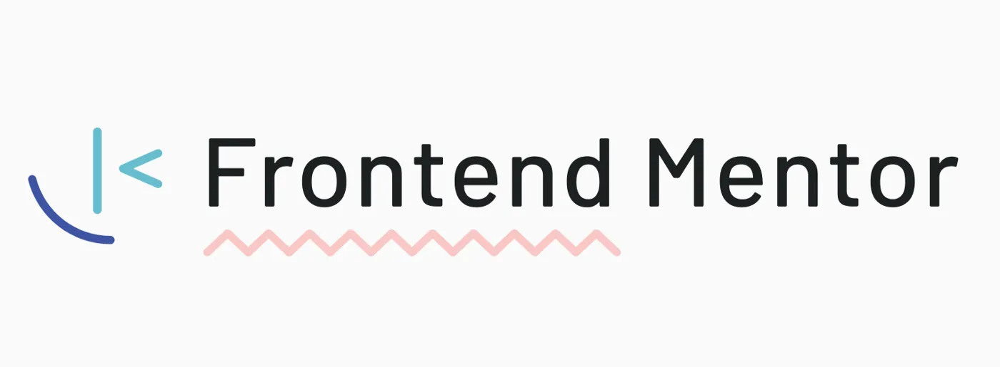

# Frontend Mentor Newbie Challenges

## Table of contents

- [Introduction](#introduction)
- [What you will learn](#what-you-will-learn)
- [Frameworks you can also use](#frameworks-you-can-also-use)
- [UI Libraries you can use](#ui-libraries-you-can-use)
- [Useful resources](#useful-resources)
- [Author](#author)

### Introduction

Frontend Mentor is a website with many coding challenges that helps developers to practice their coding skills such as HTML, CSS and JavaScript.
Frontend Mentor have 2 profile plans: Free and Premium.

- Free accounts have access to only free challenges and starter files but design files are excluded.
- Premium accounts have access to all challenges and starter files and also figma and sketch design files.

### What you will learn

- Semantic HTML
- CSS3
- Flexbox
- Grid
- Responsive Web Design
- Accessibility
- JavaScript

### Frameworks you can also use

- [React](https://reactjs.dev/) - JS library
- [Next.js](https://nextjs.org/) - React framework
- [Angular](https://angular.io/)
- [Vue](https://vuejs.org/)
- and others

### UI Libraries you can use

- [Styled Components](https://styled-components.com/)
- [Tailwindcss](https://tailwindcss.com/)
- [Bootstrap](https://getbootstrap.com/)
- [Material ui](https://mui.com/)
- [Chakra ui](https://chakra-ui.com/)

### Useful resources

- [MDN Docs](https://developer.mozilla.org/en-US/) - Mozilla Developer Network is a Great Reference for HTML, CSS, JavaScript and more.

- [Freecodecamp](https://www.freecodecamp.org/) - Freecodecamp is the biggest platform with 9000+ tutorials for both Frontend developers and Backend developers.

- [Google's Web Learning Platform](https://web.dev/learn/) - Google's Web Learning Platform is the best platform for beginners to learn web development from scratch.

- [Project Odin](https://www.theodinproject.com/) - Project Odin is another Great Open Source Reference for developers to Get into Web development market.

- [Dev.to](https://dev.to/) - Dev.to is free blogging platform for developers to share their knowlegde.

### Author

- Frontend Mentor - [sina ghadimi](https://www.frontendmentor.io/profile/sina-ghm)

- Github - [sina ghadimi](https://github.com/sina-ghm)

- Twitter - [sina ghadimi](https://x.com/realsinaghadimi)
